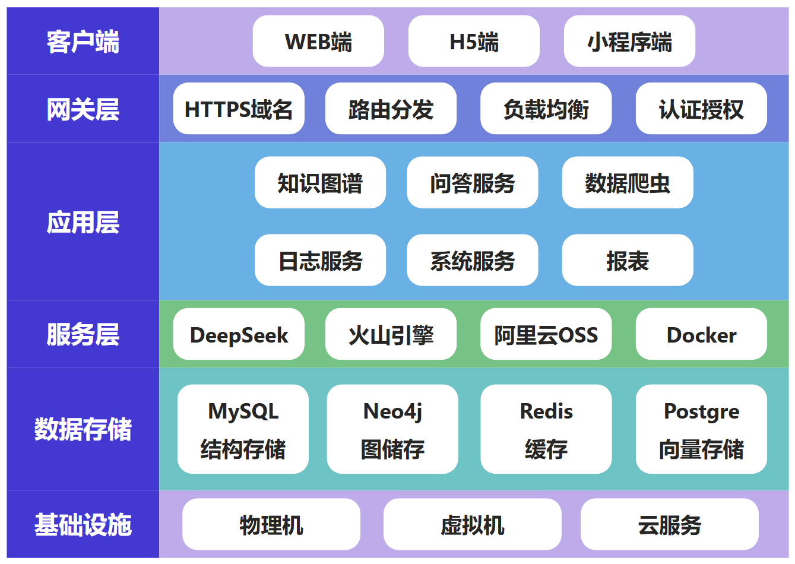
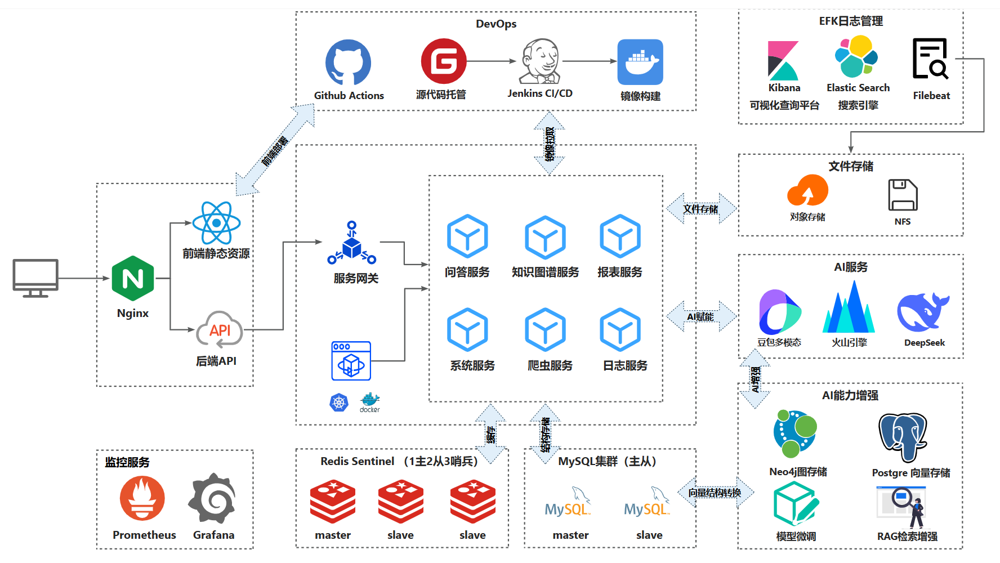
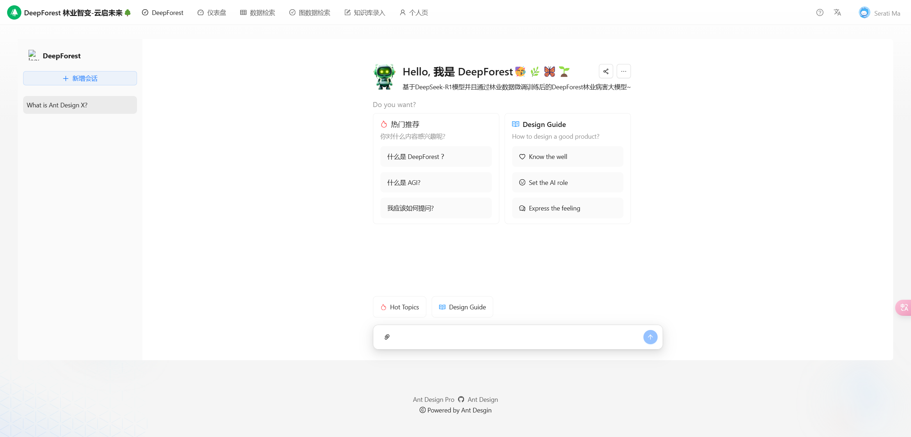
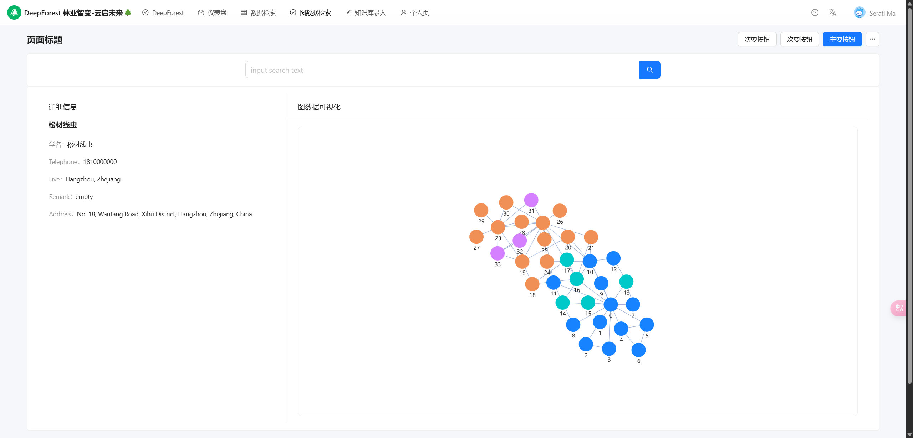

    

<h1 align="center">DeepForest</h1>

  <strong>基于DeepSeek微调模型 + RAG + Neo4j知识图谱 + 数据爬虫的林业病虫害智能问答系统。
     致力于打造企业级AI应用开发的最佳实践，包含分布式爬虫、数据清洗、图数据库建模与RAG实践。
     <em>持续更新 ing～</em>
  </strong>

    
    
    
    
    <a href="https://github.com/Azure12355/deep-forest/commits" target="_blank"> 
    
    
     
     
     

## 项目导航

- **快速体验地址**：[deep-forest首页](https://azure12355.github.io/deep-forest-frontend/)
- **前端项目仓库**：[deep-forestWeb](https://github.com/Azure12355/deep-forest-frontend)
- **码云仓库**：[Gitee](https://gitee.com/Azure12355/deep-forest)（国内访问速度更快）

## 项目介绍

deep-forest是一个林业病虫害智能问答系统，基于DeepSeek微调模型，结合RAG（检索增强生成）和Neo4j知识图谱技术，通过分布式数据爬虫获取林业相关数据。项目采用SpringBoot作为后端Web框架，前端使用React搭配AntDesign全家桶，构建清晰、美观、用户友好的UI界面。涵盖高性能分布式爬虫设计、数据清洗、数据库建模、图数据库实体建模、模型微调流程和RAG实践等技术，完全遵循企业级开发规范，持续更新中。

### 项目演示

#### C端项目

- 前端源码地址：[https://github.com/Azure12355/deep-forest-frontend](https://github.com/Azure12355/deep-forest-frontend)
- 项目演示地址：[https://azure12355.github.io/deep-forest-frontend/](https://azure12355.github.io/deep-forest-frontend/)

### 技术选型

#### 后端技术

|         技术          | 说明        | 官网                                                                                     |
|:-------------------:|-----------|----------------------------------------------------------------------------------------|
|     SpringBoot      | 后端Web开发框架 | [https://spring.io/projects/spring-boot](https://spring.io/projects/spring-boot)       |
|        Neo4j        | 知识图谱数据库   | [https://neo4j.com](https://neo4j.com)                                                 |
|      DeepSeek       | 微调模型      | [https://deepseek.ai](https://deepseek.ai)                                             |
|        Redis        | 缓存加速与分布式锁 | [https://redis.io](https://redis.io)                                                   |
|       Docker        | 容器化部署     | [https://www.docker.com](https://www.docker.com)                                       |
|       Scrapy        | 分布式爬虫框架   | [https://scrapy.org](https://scrapy.org)                                               |
|       Lombok        | 简化Java代码  | [https://projectlombok.org](https://projectlombok.org)                                 |
|     Swagger-UI      | API文档生成工具 | [https://github.com/swagger-api/swagger-ui](https://github.com/swagger-api/swagger-ui) |
| Hibernate-validator | 接口参数校验    | [http://hibernate.org/validator/](http://hibernate.org/validator/)                     |

#### 前端技术

|    技术     | 说明     | 官网                                         |
|:---------:|--------|--------------------------------------------|
|   React   | 前端开发框架 | [https://reactjs.org](https://reactjs.org) |
| AntDesign | UI组件库  | [https://ant.design](https://ant.design)   |

前往[deep-forest-frontend](https://github.com/Azure12355/deep-forest-frontend)查看更多前端技术细节。

### 环境搭建

在项目目录下的`application.yml`修改启动环境`spring.profiles.active` = `test`，然后在`application-test.properties`
中配置相关环境参数（如Neo4j、Redis连接信息）。详细步骤见[项目文档](https://www.yuque.com/Azure12355/deep-forest)。

### 项目文档

提供保姆级教学路线，涵盖环境搭建、分布式爬虫实现、知识图谱构建、模型微调、RAG实践等内容，持续更新中～

## star 趋势图

## 贡献

**贡献之前请先阅读[行为准则](CODE_OF_CONDUCT.md)和贡献指南。感谢所有为deep-forest做过贡献的人!**

#### 后端:

  

#### 前端:

  

## License

[Apache License 2.0](./LICENSE)
