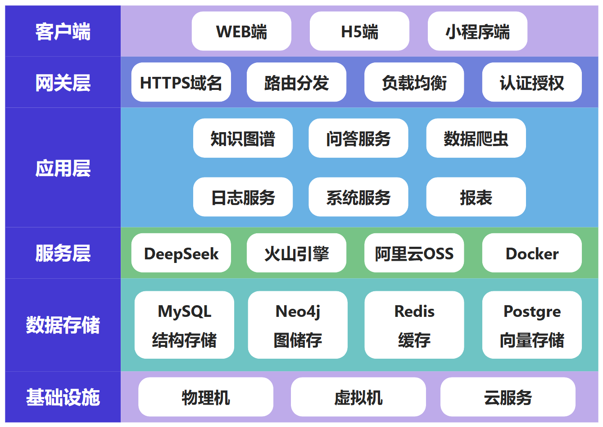

<p align="center">
    <a href="" target="_blank">
      
    </a>
</p>

<h1 align="center">DeepForest Backend</h1>

<p align="center">
  <strong>基于 Spring Boot 3、Spring AI、火山引擎大模型、知识图谱与多源数据构建的智能林业后端服务。</strong>
  <br>
  为 DeepForest 前端应用提供强大的 API 支持，涵盖智能问答、数据分析、知识图谱和高级检索等核心功能。
</p>

<div align="center">
    <a href="https://github.com/Azure12355/deep-forest/blob/master/LICENSE" target="_blank">
        
    </a>
    <a href="https://github.com/Azure12355/deep-forest" target="_blank">
        
    </a>
    <a href="https://github.com/Azure12355/deep-forest/issues" target="_blank">
        
    </a>
    <a href="https://spring.io/projects/spring-boot" target="_blank">
        
    </a>
     <a href="#" target="_blank">
        
    </a>
</div>

# 关联项目🔗
- DeepForest前端代码: https://github.com/Azure12355/deep-forest-next-js
- DeepForest爬虫代码: https://github.com/Azure12355/deep-forest-spider

## 🌲 项目简介

**DeepForest Backend** 是 "DeepForest - 智能林业病虫害问答与知识图谱系统" 的核心后端服务。它采用现代化的 Java 技术栈构建，旨在成为一个企业级的、可扩展的、高性能的 AI 应用后端。

本项目不仅提供了支撑前端各项功能的 API，还体现了在构建复杂 AI 应用中的一系列最佳实践，包括：

*   **多模型集成**: 无缝集成并调用主流大语言模型（如火山引擎豆包大模型、DeepSeek 等）。
*   **流式响应 (SSE)**: 为智能问答提供实时的、打字机效果的流式响应。
*   **知识图谱支持**: 设计了与图数据库（如 Neo4j）交互的数据模型和服务接口。
*   **模块化设计**: 将业务逻辑清晰地划分为智能问答、数据分析、知识图谱和搜索四大模块。
*   **模拟数据驱动**: 内置了极其丰富的 Mock 数据层，支持在无数据库或第三方服务依赖的情况下进行完整的端到端开发和测试。



### 关联项目

*   🎨 **前端项目**: [deep-forest-next-js (React)](https://github.com/Azure12355/deep-forest-next-js)
*   🌐 **项目演示地址**: [DeepForest 首页](https://deepforest.weilanx.com)

## ✨ 功能模块 API

本项目为前端提供了四大核心功能的 API 支持：

*   **智能问答 (`/api/chat`)**:
    *   接收用户提问（文本+文件），与大模型进行交互。
    *   通过 Server-Sent Events (SSE) 技术，将 AI 的思考过程和最终答案以流式数据推送给前端。
    *   管理和查询聊天历史。

*   **数据分析 (`/api/analysis`)**:
    *   提供仪表盘所需的全量数据，包括核心指标（KPIs）、物种分类统计、地理分布热力图数据等。
    *   所有数据经过精心聚合，便于前端直接渲染 ECharts 图表。

*   **知识图谱 (`/api/graph`)**:
    *   提供构建和可视化知识图谱所需的所有节点（Nodes）和关系（Links）数据。
    *   数据结构与前端 ECharts Graph 图表的需求完美匹配。

*   **知识检索 (`/api/search`)**:
    *   提供强大的后台搜索接口，支持关键词查询、多维度筛选和分页。
    *   提供根据 ID 获取物种完整、结构化详情数据的接口。

## 🛠️ 技术栈

| 技术                  | 说明                                   | 官网/文档                                              |
| --------------------- | -------------------------------------- | ------------------------------------------------------ |
| **核心框架**          |                                        |                                                        |
| Spring Boot           | 现代化 Java Web 开发框架               | [spring.io](https://spring.io/projects/spring-boot)    |
| Java                  | 编程语言 (JDK 17)                      | [openjdk.java.net](https://openjdk.java.net/)          |
| **AI & 大模型**       |                                        |                                                        |
| Spring AI             | Spring 生态的官方 AI 集成框架          | [Spring AI](https://spring.io/projects/spring-ai)      |
| 火山引擎 Ark (豆包)     | 核心大模型服务 (SDK 集成)              | [volcengine.com](https://www.volcengine.com/product/ark)|
| **数据存储与访问**    |                                        |                                                        |
| Neo4j (设计)          | 知识图谱数据库                         | [neo4j.com](https://neo4j.com)                         |
| Elasticsearch (设计)  | 全文搜索引擎                           | [elastic.co](https://www.elastic.co/)                  |
| MySQL (设计)          | 关系型数据库                           | [mysql.com](https://www.mysql.com/)                    |
| **工具与库**          |                                        |                                                        |
| Maven                 | 项目构建与依赖管理                     | [maven.apache.org](https://maven.apache.org/)          |
| Lombok                | 简化 Java 代码                         | [projectlombok.org](https://projectlombok.org/)        |
| Reactor & RxJava      | 响应式编程库 (用于适配 SSE)            | [projectreactor.io](https://projectreactor.io/)        |
| Hutool                | Java 工具类库                          | [hutool.cn](https://hutool.cn/)                        |
| **部署**              |                                        |                                                        |
| Docker                | 容器化部署                             | [docker.com](https://www.docker.com/)                  |

## 🚀 快速开始

### 1. 环境准备

请确保您的开发环境中已安装：
*   **JDK 17** 或更高版本。
*   **Apache Maven** 3.6+ (项目内置了 Maven Wrapper，也可直接使用)。
*   (可选) 一个你喜欢的 IDE，如 IntelliJ IDEA 或 VS Code。

### 2. 克隆项目

```bash
git clone https://github.com/Azure12355/deep-forest.git
cd deep-forest
```

### 3. 配置环境变量

本项目需要配置大模型的 API Key。最简单的方式是直接在您的 IDE 运行配置中设置环境变量。

*   **变量名**: `VOLCANO_API_KEY`
*   **变量值**: `你的火山引擎Ark API Key`

> **💡 如果您想使用其他模型**：
>
> 1.  修改 `src/main/resources/application.yml` 文件。
> 2.  注释掉当前的 `spring.ai.openai` 配置块。
> 3.  取消注释您想使用的模型配置块（如 OpenAI HK 或 阿里云通义千问），并设置对应的环境变量（如 `OPENAI_API_KEY` 或 `ALIYUN_API_KEY`）。

### 4. 运行项目

您可以通过以下两种方式运行项目：

**方式一：使用 IDE 运行**

1.  用 IntelliJ IDEA 或其他 Java IDE 打开项目。
2.  找到 `src/main/java/com/weilanx/deepforest/MainApplication.java` 文件。
3.  直接运行 `main` 方法。

**方式二：使用 Maven Wrapper 运行**

在项目根目录下打开终端，执行以下命令：

```bash
# Windows
./mvnw spring-boot:run

# macOS / Linux
./mvnw spring-boot:run
```

当您在控制台看到 Spring Boot 的启动日志和类似 `Tomcat started on port(s): 8101` 的信息时，表示后端服务已成功启动！🎉

服务默认运行在 `http://localhost:8101`，API 基础路径为 `/api`。例如，分析仪表盘的接口地址是 `http://localhost:8101/api/analysis/dashboard`。

## 🚢 部署指南

我们强烈推荐使用 Docker 进行生产环境部署。

### 1. 构建项目 JAR 包

首先，需要将项目打包成一个可执行的 JAR 文件。
```bash
./mvnw clean package
```
命令执行成功后，您会在 `target/` 目录下找到一个名为 `deep-forest-0.0.1-SNAPSHOT.jar` 的文件。

### 2. 构建 Docker 镜像

项目根目录已提供一个优化过的 `Dockerfile`。执行以下命令构建镜像：
```bash
docker build -t deep-forest-backend:latest .
```
> `deep-forest-backend:latest` 是镜像的名称和标签，您可以自定义。

### 3. 运行 Docker 容器

使用以下命令运行您刚刚构建的镜像：
```bash
docker run -d -p 8101:8101 \
  -e "VOLCANO_API_KEY=你的火山引擎API_Key" \
  --name deep-forest-app \
  deep-forest-backend:latest
```
**命令解析:**
*   `-d`: 后台运行容器。
*   `-p 8101:8101`: 将主机的 8101 端口映射到容器的 8101 端口。
*   `-e "VOLCANO_API_KEY=..."`: **通过环境变量将您的 API Key 安全地传递给容器**。这是推荐的做法，避免将敏感信息硬编码。
*   `--name deep-forest-app`: 为容器指定一个易于管理的名称。
*   `deep-forest-backend:latest`: 您构建的镜像名称。

现在，您的后端服务正在 Docker 容器中稳定运行，并通过 `http://<您的服务器IP>:8101` 对外提供服务。

> 💡 **生产环境建议**: 在生产环境中，建议使用 Nginx 等反向代理来管理域名、HTTPS 证书，并将 `/api` 路径的请求转发到此容器。您可以参考前端项目 `README.md` 中提供的 Nginx 配置示例。

## 📁 项目结构

```
deep-forest/
├── doc/                        # 项目文档和图片资源
├── sql/                        # 数据库初始化脚本和 ES Mapping
├── src/
│   ├── main/
│   │   ├── java/
│   │   │   └── com/weilanx/deepforest/
│   │   │       ├── analysis/   # 📊 数据分析模块
│   │   │       ├── chat/       # 💬 智能问答模块 (含SSE流式处理)
│   │   │       ├── common/     # 📦 通用响应、错误码等
│   │   │       ├── config/     # ⚙️ Spring 配置 (跨域, AI等)
│   │   │       ├── graph/      # 🕸️ 知识图谱模块
│   │   │       ├── search/     # 🔍 知识检索模块
│   │   │       └── MainApplication.java  # 🚀 Spring Boot 启动类
│   │   └── resources/
│   │       └── application.yml # 核心配置文件
│   └── test/                   # 测试代码
├── .gitignore
├── Dockerfile                  # 🐳 Docker 部署文件
├── pom.xml                     # Maven 依赖与构建配置
└── README.md                   # 就是你现在正在看的这个文件 :)
```
每个功能模块（如 `analysis`, `chat`）内部都遵循 `controller` -> `service` -> `dto` (或 `mock`) 的分层结构，职责清晰，易于维护。

## 🤝 贡献代码

我们热烈欢迎任何形式的贡献！无论是提交 Bug、提出功能建议还是直接贡献代码。

1.  **Fork** 本仓库。
2.  创建您的特性分支 (`git checkout -b feature/AmazingFeature`)。
3.  提交您的更改 (`git commit -m 'Add some AmazingFeature'`)。
4.  将分支推送到您的仓库 (`git push origin feature/AmazingFeature`)。
5.  创建一个 **Pull Request**。

## 📄 开源许可证

本项目基于 [Apache License 2.0](./LICENSE) 许可证开源。

---

感谢您对 DeepForest 项目的关注！如果这个项目对您有帮助，请不要吝啬您的 ⭐ Star！